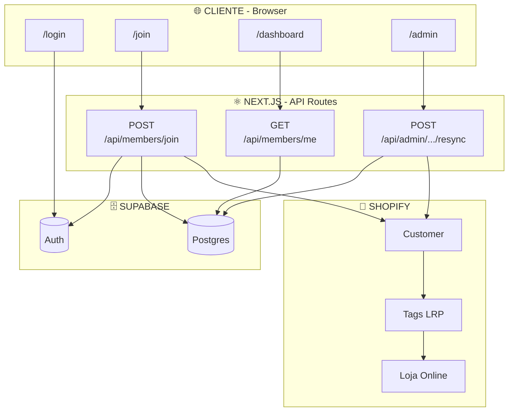
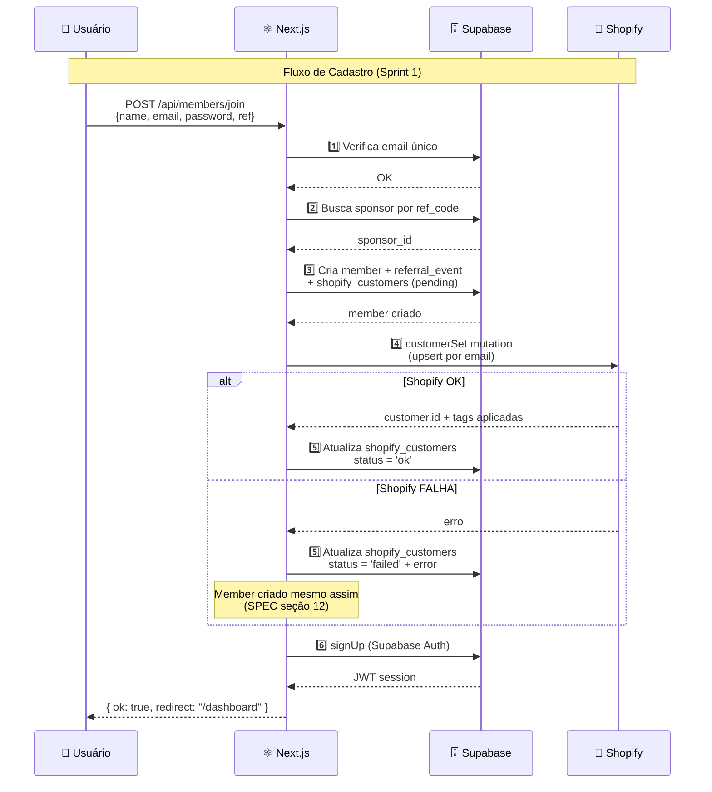
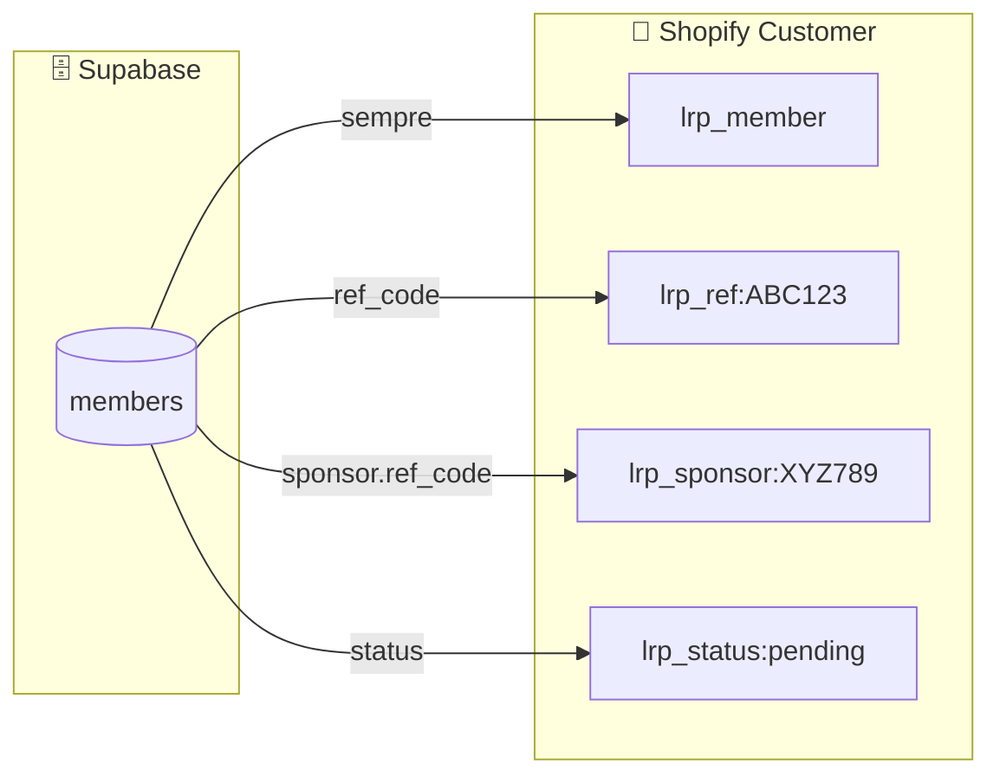
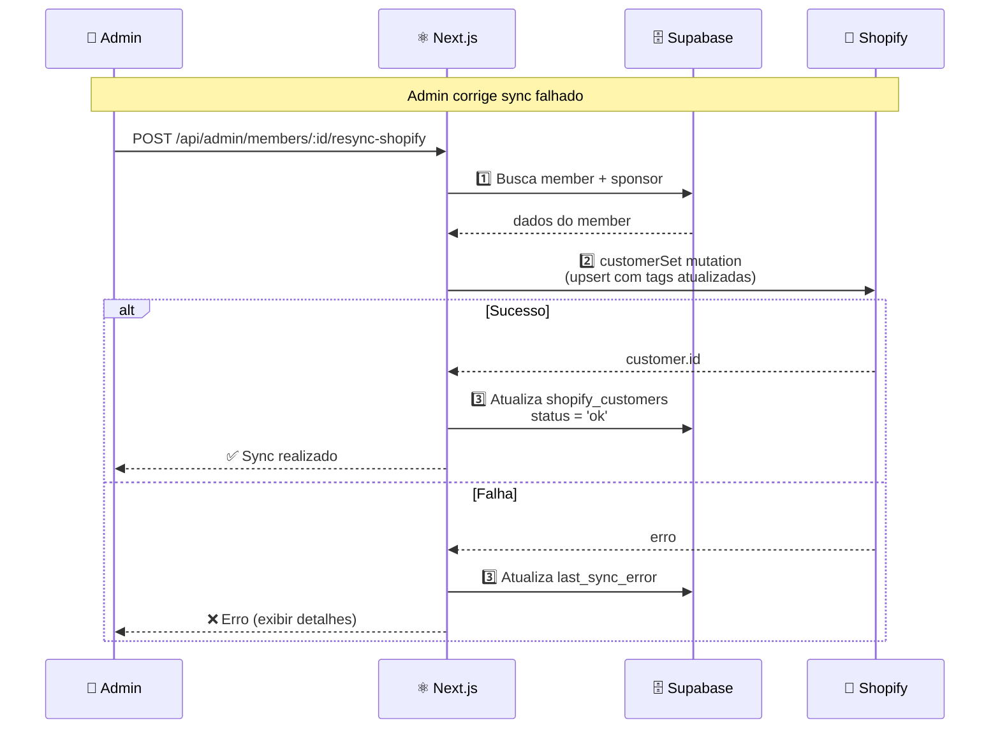
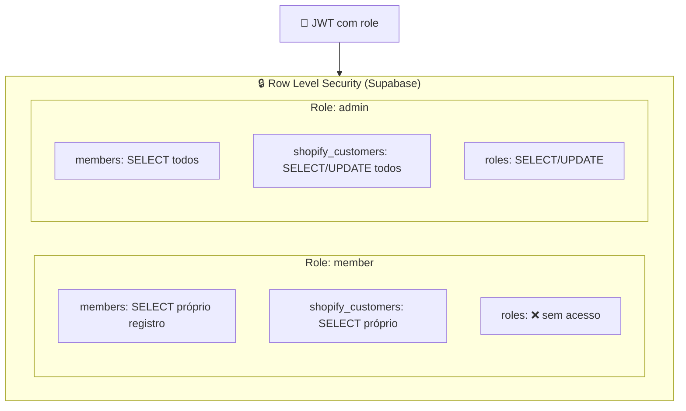
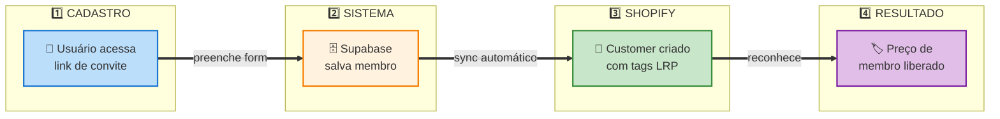

# Diagrama de Arquitetura — Biohelp LRP

> **Documento para apresentação ao cliente**  
> Sprint 1: Cadastro + Rede + Auth + Shopify Sync

---

## 1) Visão Geral do Sistema



### Legenda de Conexões

| De | Para | Descrição |
|----|------|-----------|
| `/join` | API Join | Formulário de cadastro |
| API Join | Supabase | Cria member + auth |
| API Join | Shopify | Cria/atualiza customer |
| API Resync | Shopify | Re-sincroniza tags |
| Customer | Tags | Aplica tags LRP |
| Tags | Loja | Libera preço de membro |

---

## 2) Modelo de Dados (Supabase)

```mermaid
erDiagram
    MEMBERS {
        uuid id PK
        text name
        text email UK "único"
        text ref_code UK "imutável"
        uuid sponsor_id FK "nullable"
        text status "pending|active|inactive"
        timestamptz created_at
    }

    REFERRAL_EVENTS {
        uuid id PK
        uuid member_id FK
        text ref_code_used "nullable"
        jsonb utm_json "nullable"
        timestamptz created_at
    }

    SHOPIFY_CUSTOMERS {
        uuid id PK
        uuid member_id FK UK
        text shopify_customer_id
        timestamptz last_sync_at
        text last_sync_status "ok|failed|pending"
        text last_sync_error "nullable"
    }

    ROLES {
        uuid id PK
        uuid member_id FK UK
        text role "member|admin"
    }

    MEMBERS ||--o{ MEMBERS : "sponsor_id (rede)"
    MEMBERS ||--|| REFERRAL_EVENTS : "member_id"
    MEMBERS ||--|| SHOPIFY_CUSTOMERS : "member_id"
    MEMBERS ||--|| ROLES : "member_id"
```

---

## 3) Sincronização Supabase ↔ Shopify



---

## 4) Tags Aplicadas no Shopify Customer



### Tabela de Mapeamento

| Campo Supabase | Tag Shopify | Exemplo |
|----------------|-------------|---------|
| (sempre presente) | `lrp_member` | `lrp_member` |
| `members.ref_code` | `lrp_ref:<ref_code>` | `lrp_ref:ABC123` |
| `sponsor.ref_code` | `lrp_sponsor:<sponsor_ref_code\|none>` | `lrp_sponsor:XYZ789` |
| `members.status` | `lrp_status:<status>` | `lrp_status:pending` |

---

## 5) Fluxo de Resync (Admin)



---

## 6) Políticas de Segurança (RLS)



---

## 7) Resumo Visual para Cliente (Apresentação Executiva)



### Fluxo Simplificado em 4 Passos

| Passo | O que acontece | Onde |
|-------|---------------|------|
| **1** | Usuário clica no link de convite e preenche cadastro | `/join?ref=XXX` |
| **2** | Sistema salva o membro e vincula ao sponsor | Supabase |
| **3** | Sistema cria/atualiza customer automaticamente | Shopify |
| **4** | Cliente pode comprar com preço de membro | Loja Online |

---

## 8) Stack Tecnológica

| Componente | Tecnologia | Função |
|------------|------------|--------|
| **Frontend** | Next.js 14 (App Router) | UI + SSR |
| **Auth** | Supabase Auth | Login/Sessão JWT |
| **Database** | Supabase (Postgres) | Dados + RLS |
| **E-commerce** | Shopify Admin API | Customer + Tags |
| **Deploy** | Vercel | Hosting |

---

## Anexo: Como Visualizar Este Diagrama

1. **GitHub/GitLab**: Abre automaticamente os diagramas Mermaid
2. **VS Code**: Extensão "Markdown Preview Mermaid Support"
3. **Online**: [mermaid.live](https://mermaid.live) — cole o código e exporte PNG/SVG
4. **Notion**: Suporta blocos Mermaid nativamente

---

*Documento gerado em: Dezembro 2024*  
*Versão: Sprint 1 — MVP Operacional*

